# web协议 详解与抓包实战

## 03. 浏览器发起http请求的典型场景

### 工具积累

- [Telnet工具](https://blog.csdn.net/wangjianno2/article/details/48933213)可以终端访问主机测试端口号等
- [抓包工具Wireshark](https://www.cnblogs.com/lsdb/p/9254544.html)
- [curl工具](https://)
  - mac中自带的工具，它可以去模拟发送http请求，可以任意修改http的请求头部，发送后终端中可以清楚的看到服务端返回body的原始受压缩二进制形式，也可以设置解压缩看明文形式， -- compresses是解压缩的意思，删了它是不解压缩二进制的形式，-H是向http请求添加请求头的意思
  - window中需要额外安装
- OCTET二进制编码 DIGET十进制编码 HEXDIG十六进制编码
- **必知**
  - http协议传输在wireshark抓包工具中得知，http消息底层TCP协议传输过程中都是变成**16进制码流**进行传输的，
  - 如果数字也是先转成ASCII码，再根据ASCII码变成16进制
  - 若是英文字母或汉字，则也先变成ASCII码(数字格式)，然后再将其转成16进制入到16进制码流。(如协议传输K字母过去，会变成ASIC码75，75转16进制，变成4b，作为码流)

### 地址栏输入框整体场景步骤:

- A用户界面---->B浏览器引擎---->C浏览器的渲染引擎
  - B引擎负责查询操作渲染引擎：可以根据历史记录联想出要敲的url完整地址
  - C引擎负责解析渲染请求的内容。
  - 输入完成敲回车之后，浏览器就调用了C渲染引擎就是chrome中的webkit引擎，渲染引擎首先会发出第一个网络请求，通过网络模块，等待html响应回来以后，渲染引擎中间就会发现一些超链接(例如一个javascript脚本请求)-->即又会发起javascript的网络请求，等到javascript资源响应回来以后，C就会调用JS解释器，来解析js文件，---> 当渲染引擎拿到html，js，css资源，图片或其他媒体文件以后---> 就会通过UI后端把完整的ui界面绘制到用户界面中。

### HTTP定义

- 定义：一种无状态的，应用层的，以请求/应答方式运行的协议，它使用可扩展的语义和自描述消息格式，与基于网络的超文本信息系统灵活的互动
  - 无状态：我们两个连续的请求，后一个请求不能依赖前一个请求中相应的字段header头部啥的
  - 语义是可扩展的：服务器不支持http1.1，但浏览器支持1.1，两者依然可以正常通讯
  - 自描述：通过header就能描述出想要什么样的资源
  - 超文本系统：不只是文档，还支持图片音频视频等大力度内容

## 04. 基于ABNF写义语法定义的HTTP消息格式

- 上图是比较口语化的http消息格式，橙色代表请求行即开始行状态行(响应行)，蓝色代表头部多个属性，紫色代表body部
- 有问题

### 引入ABNF（增强版巴科斯范式）-- 操作符

我们定义写义语法时常用ABNF规范

- 空白字符：用来分隔定义中的各个元素
- 选择/：表示多个规则都是可供选择的规则
  - start-line = request-line / status-line
  - start-line：起始行，分为request-line请求行 和 status-line响应行
- 值范围：%c##-## 如下面的16进制的30到37  下面两种方式是等价的， %x前缀就代表16进制
- 
- 序列组合（）：将规则组合起来，视为单个元素
- 不定量重复：m*n
  - *元素：表示零个或更多元素 *(header-field CRLF)
  - 1*元素：表示1个或更多元素，2*4元素：表示2至4个元素
- 可选序列 []
  - 如[message-body] ---包体可有可无

### 引入ABNF（增强版巴科斯范式）-- 核心规则

- 
- 可知CRLF代表换行的意思

### 基于ABNF描述的HTTP协议格式

- 完整一条HTTP消息叫HTTP-message，HTTP-message含三部分组成：
  1. 红色：start-line起始行：又含请求行和响应行(不同语法格式)
     1. 中间的CRLF是换行\r\n的语义
  2. 绿色：Header-field头部
  3. 蓝色：message-body包体。

- 

- 安装telnet工具，使用telnet命令测试下域名的连接。
  - `telnet www.taohui.pub 80` 回车后出现当前域名端口是可用的 ---> 然后就可以输入一个http请求了
  - 接着命令中输入一个请求：`GET(方法) 域名下的访问目标路径 HTTP/1.1(写明版本) Host: www.taohui.pub` (host里填上我们的域名) ---> 敲击回车
  - 返回了HTTp的响应 即HTTP-message，即下图返回的内容 ---> 我们就对着返回的内容和格式图来对照介绍下具体的ABNF类HTTP协议格式长啥样
  - 
    - 上面一段是请求行 响应行
    - 中间一段是响应头部
    - 下面一段是包体

## 05. 网络为什么要分层：OSI模型与TCP IP模型

### OSI

OSI从来没有被真正实现过，但我们做网络的时候必须参考这样一个概念模型，才能更好的理解网络中协议分层这回事

- 7层应用层：处理http协议，p2p，telnet，ERPC协议，处理nginx，apache等负载均衡设备，解决的是我们业务问题
- 6层表示层：应用层之下是表示层，它负责把网络中的消息转化成应用层可以读取的消息格式，所以TLS LLS协议是工作在表示层的
- 5层会话层：是完全概念化中的一层，负责建立会话握手，维持连接关闭等。
- 4层传输层：TCP协议，UDP协议，首先解决的是进程与进程之间的通讯(就是报文发到了我们主机上，我们主机应该分发给哪一个进程呢由传输层来决定)
  - 其中TCP协议还保证了报文可达性，流量的控制
- 3层网络层：主要是IP协议，确保了在广域网(英特网)中，可以从一个主机上把抱文发送到另一个主机上---路由器
- 2层数据链路层：在局域网中，使用MAC地址链接到相应的交换机或路由器，就可以支持在上层把报文转移到另外一个主机上了，只可以工作在以太网等局域网上---交换机
- 1层物理层：物理的一些介质

### OSI只是个概念模型，实际上在我们因特网的实现我们把他叫做TCP/IP模型，在TCPIP模型做了大量简化

- 这样分层有什么好处呢？比如我们IPV4升IPV6他是非常苦难呢的，分层的话就可以只关注应用层做一下升级，其他层不用什么改变复用即可
- 最大的坏处？分层每层都需要为报文从上到下做数据转化处理，会导致数据延迟的，性能下降，为了解决这些性能问题就诞生了相应的组件出来，比如英特尔的DVDk库

### 通过抓包工具看下网络分层是怎么体现出来的

- 首先网络在物理层传输介质是比特流Bit这样一个二进制，到了数据链路层，我们称他为Frame，Frame就是我们的以太网(Ethernet)层(在Frame中会加个MAC头)，到了网络层的时候，我们叫他为Packet(在Packet中会加个IP头)，再网上会加个TCP头，以此类推，HTTP上也有HTTP头。

- 下面通过Wireshark抓包工具显示的分层信息截图

## 06. HTTP解决了什么问题

### HTTP协议为什么是现在这个样子

### HTTP解决了啥

## 07. 评估Web架构的7大关键属性

- 
- 
  - 吞吐量就是高并发下的tps，每秒处理的请求数或事务数
  - 开销：如HTTP/1.1中的Keep-alive就是长连接，首次连接时候是三次握手开销，TCP控制的开销，每次开销就是如多次发同个请求时复用请求的头部的每次开销
  - 重用缓存也能提升性能：因为用缓存压根就不走网络了，这时网络效率是最高的
  - 减少交互次数：如一些小的图片给base64编码，放进html文件中，就不用浏览器发起额外的图片资源请求了，就减少了交互次数
  - 传输距离更近：如就近建立CDN资源
- 
- 
  - 我们现在操作的web环境就遵循这样一个rest架构web体系，他的推导过程见下节。
  - userAgent就是我们浏览器，有abc3条路径访问到服务器

## 08. 从5种架构风格推导出HTTP的REST架构

### 在分布式web架构中，主要有5类架构风格

- 数据流风格
  - 之前介绍的协议的分层就是一种数据流风格
  - 优点：简单性，可进化性，可扩展性，可配置性可重用性
- 复制风格
  - 优点：用户可察觉的i性能，可伸缩性，网络效率，可靠性也可以得到提升
- 分层风格
  - 优点：简单性，可进化性，可伸缩性
- 移动代码风格
  - 优点：可移植性，可扩展性，网络效率
- 点对点风格
  - 优点：可进化性，可重用性，可扩展醒 可配置性

----

- 
- 
- 
- 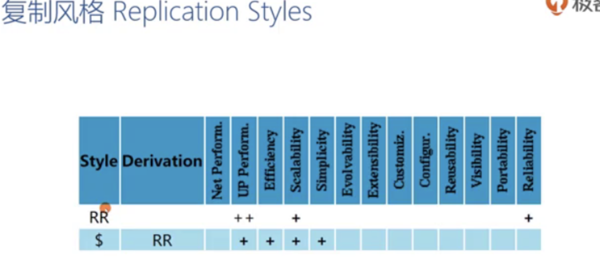
- 
  - 其中CSS加入了无状态就是不允许有会话状态，这次服务器请求结果不会关联上次请求的结果状态有关系都是无状态的这样
  - 若加入了缓存称为$,就是C$SS系统，缓存就解决了因为重复数据，反复传递相同的Header，导致的网络资源消耗得到缓解。
  - LC$SS把前面正反向代理等特点都整合到了一起
- 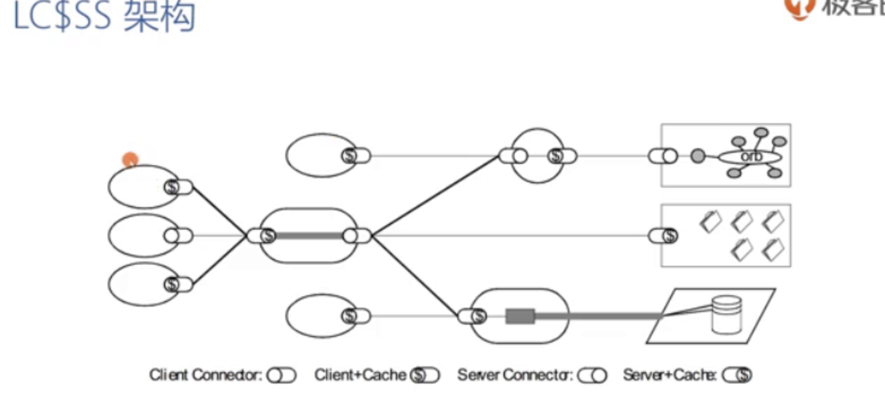
- 
  - 这两种分层风格是rest架构中没有使用的，如远程会话，需要保存每次应用状态，如FTP协议，每次FTP发送一个协议的时候，都要知道之前发出来的请求导致现在这个客户是在哪一层目录，发送了哪些端口，都需要服务器来保存的。所以不能任意扩充服务器避免对客户端产生影响可伸缩性差，可见性差就是抓取个报文没法得到完整的请求信息的
  - 第二种是RDA，典型的例子就是circle语言来访问数据库大量数据集应用状态游标存在客户端存当前查的第几页数据，服务端也会存相关的数据
- 
- 
  - 任意代码风格就是实际程序要执行的那个代码是可以任意的从客户端和服务端之间移动的，所以他相关的有上面这5种架构风格。
  - 我们最常见的js就是这种COD模型，当我们浏览器需要访问js的时候，就会从服务器拉取js，把js在浏览器内执行
  - 还有一种是移动代理：它相当于REV+COD
- 
- 
- 
  - 这4个是rest架构中没有使用的，但在分布式网络中使用的多
- 

#### 在http协议中rest架构就是按照分层风格中scalability表现比较好的类别

### 风格演化

刚我们介绍了五大种架构，最后是怎么得到的HTTP的REST架构呢？
- 
  - 先从没有任何架构的原点开始出发，使用复制特性得到了复制仓库RR模型(即我们要允许我们的服务器同时部署多个提供相同服务功能的进程，为客户端服务)，接着加入了$缓存特性，然后再从原点具备隔离性分离关注点，所以我们得到了CS架构(客户端服务器分离)，在CS架构下进一步提升他们可见性，不再依赖于前后的请求，不需要服务去保留应用状态的情况下就引入了stateless升级成了CSS模型
  - 然后在CSS下得到一些可靠性 变成了C$SS,再给他提高下可伸缩性扩展性(通过引入分层的特性，从原点开始 空间上引入分层系统LS，协议上进行分层就得到TCPIP体系，) -> 在分层系统中再引入ClientServer模式得到LCS，再跟C$SS结合就推导出了LC$SS
  - 在LC$SS下再引入按需加载代码COD模式变成LCODC$SS,最后再引入统一的接口U(统一的接口主要表现在url或uri中)最终结合成了**REST架构**
- 对于后面HTTP学习中每一个场景了解rest架构都是有帮助的，------>我们经常在设计API的时候，有一种叫restfulAPI，它也是遵循rest架构的

## 09. 如何使用Chrome的Network面板分析HTTP报文

- 
- 
- 
  - 如可以在Filter框里输入：domain:*.baidu.com
  - 多个过滤项的话可以加空格：domain:*.baidu.com method:POST
- 
- 
- 
- 
- 
- 
- 
  - 上下游就是如html一个请求-请求了个图片资源，这个图片就是html请求的下游，而这个图片是因为下载完html文件以后才发起的这个图片请求，所以图片的上游就是html文件

### 浏览器加载触发流程
- 

### 请求时间详细分布

请求时间在点开具体请求的最右边tab项Timing项中各个字段的描述：

- 可以知道请求都是会排队的，不是并发执行的，是一个一个请求依次执行的，会等上个请求的排队时间
- 
- 

## 10. URI的基本格式以及与URL的区别

URI是HTTP协议中的一个重要组成部分，也是rest架构中的实现统一接口的一个必要手段，这节课还会介绍使用ABNF格式如何严格的定义URI的格式

### 当没有URI时

- 

### 什么是URI

- 
- 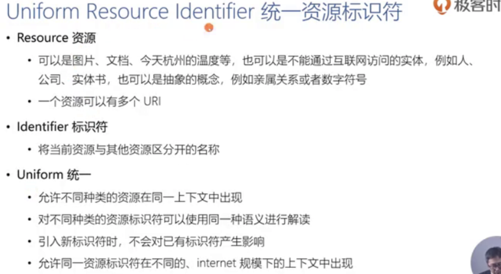
  - 一个资源可以有很多URI的，通常URI是不会经常变化的，如搜索引擎网路爬虫--爬取了很多URI若URI经常变化的话则搜索引擎无法把相应的资源建立它的索引中就降低了资源的使用效率
  - URI的目标就是倾向于创作者，只是创作者用来把我们的所拥有的资源与其他资源区分开的一个名字而已
  - 对于统一：如在一个html文件中，有一个超链接，指向的是一个图片，接下来一个超链接可能指向的是js资源，但他们是在完全同一个dom的上下文中
  - 对于统一：如我们下载一个pdf文档或者下载一个mkv的视频，就完全可以用同一种下载的方式去执行
  - 对于统一：在早期的HTTP协议中，我们URI可能主要指向的是图片和文字，那么后期引入视频等新的方式，并不会对已有的标识符产生影响
  - 对于统一：比如说我们有一个URI，如果说涉及到网络爬虫去爬取我的URI是可以的，如果是另外一个人在浏览器中阅读我的URI对应的资源也没有问题。

### URI的组成

- 
  - 默认端口是80，若HTTPS默认是43端口
- 
  - 合法的URI有很多种表达方式

### URI的格式

- 
- 
- 
- 
  - URI有绝对和相对两种，经常见的schema开头的http:这种是绝对URI，不带域名不带schema开头的就是相对URI，一般发起http请求的都是相对URI格式。
  - 所以在向正向代理发送的请求中会传递完整的绝对URI（由于为了防止版本过时地正向代理丢失中间的域名，schema等等信息）

## 11. 为什么要对URI进行编码？

日常使用URI中许多url会夹杂了大量的百分号和16进制的编码，那么编码的依据到底是什么呢，这节课介绍面对什么样的字符要进行url编码

### 为什么要进行URI编码

- 
  - 上面3个示例中都是需要编码的不能直接接收，url中并不能直接接受中文，在浏览器中能写是因为浏览器自动编码了，在代码中不能直接写中文，中文编码后但写了>也是不行(因为中间有很多代理服务器服务器可能会认为这样的编码方式有问题会把我们整个结果给截断--我们必须全部编码)
- 
  - 对出现的保留字符应进行编码防止服务器误认，非保留字符不用
- 
  - 百分号后面跟两个16进制叫做百分号编码

## 12. 详解HTTP的请求行

这节主要做了请求行的演示和诸多WEBDAV方法演示能帮我们设计出非常好的restfulAPI。。

- 
  - 那个path就是request-target 下面先讲request-target
- 
  - request-target有4种格式，最常用的格式就是origin-form格式-它是向我们源服务器(实际产生响应内容的服务器)发起请求
  - absolute-form格式是后面会跟完整的URI，为了防止低版本的正向代理没有传递域名的情况下即直接传origin-form可能会丢失相应的域名信息
  - CONNECT方法是在建立VPN等正向代理隧道的时候才会去使用
- 
  - 1.1在1.0上做了些改进如支持缓存支持长连接，对于域名的支持通过host头部做了很好的改进，后来出了2.0又做了很大改进
- 
  - HEAD方法服务器不会发送响应包体，只是用来响应中HEAD中的元数据
  - post不是幂等方法，我们提交多次的话，所得的结果是完全不同的
  - 带条件的put方法也是幂等方法
  - OPTIONS主要用作跨域的时候，同一个网页可能会访问多个域名下的资源，会用OPTIONS去判断新的域到底支持哪些方法
  - TRACE方法有风险，所以在2007年nginx0.5，17版本就不再支持了，每次发送trace方法都会返回405错误码

### 用curl工具演示

`curl static.taohui.tech -X OPTIONS -I`
就是访问这个域名使用OPTIONS方法，-I就是看OPTONS返回的响应的头部，ALLOW头部就会显示支持对应的方法的列表

### 用于文档管理的WEBDAV协议方法---也是出现在HTTP请求中的可选方法与get post同等地位

WEBDAV是支持多人协作的一个文档管理方法文件管理系统，所以可以支持锁定和解锁。对于这些方法也有助于我们设计出restfulAPI

- 
  - PROPFIND方法一般是用来查看目录的，
  - PROPPATCH如修改文件名，更改文件的修改时间
- **WEBDAV验证环境**：接下来用下面的验证环境来分别演示下讲到的WEBDAV协议中方法出现情景的报文
  - 服务器
    - Nginx
    - http_dav_module模块
    - nginx-dav-ext-module模块
  - 客户端
    - winscp
- 
- 

## 13. HTTP的正确响应码

介绍HTTP响应中的第一个组成部分：响应行。响应行中常见的响应码共分为2类(一类是100，200，300系列的表示成功的，另一类是对于400，500系列的表示错误的响应码)

- 
- 
- 
- 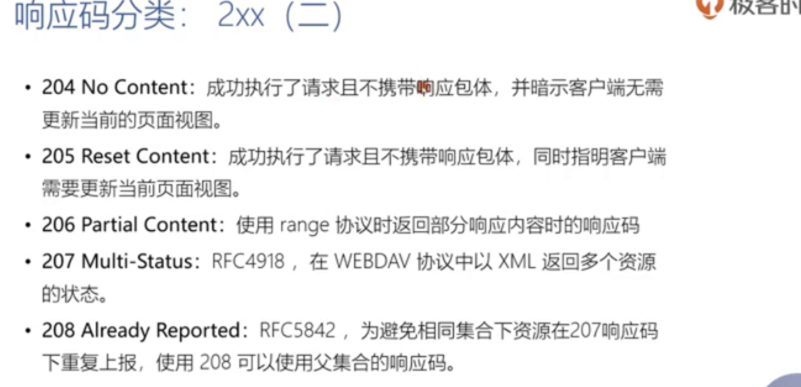
  - 后面介绍的多线程，断点续传，下载都会用到206这个在range协议中所用的响应码。
  - 当我们返回目录树的结构时，实际是返回了很多个子目录及相关的资源描述，这时候多个子目录会对应特定的多个响应码，但207作为总目录一个整体的响应码，具体各个子目录的具体响应码还是不一样的看具体的
  - 208也是为了解决WEBDAV协议的，在WEBDAV目录树中有很多子目录是属于同一个集合，那么同一个集合中每一个资源重复报同一个响应码是没有必要的，使用208可以使用父集合
- 
  - 重定向会使用Location头部指向资源
  - 300在内容协商中会协商说明，表示允许客户端主动地选择一种资源的表述方式
  - 301和302是最常见的重定向URI，301是永久重定向，302是临时重定向，永久重定向意味着浏览器可以对其直接缓存
- 
  - 303是重定向到其他资源，常用于postput
  - 304则用于缓存，在缓存一节详细说明
  - 307和308则是对301和302的一个补充，原301302重定向时候是可以对原方法做修改的，而307308是不能改变的

## 14. HTTP的错误响应码

400和500类的错误码

- 
  - 407就是对401的一个补充，401往往是originserver原服务器返回的用户验证信息不通过，如果代理服务器会首先验证用户的认证信息的话，代理服务器认为没有通过就会返回407
  - 搭建了个服务器，但是对某个服务器目录下的某个文件没有访问权限不能响应给客户端，所以告诉前端403
  - 410是对404的一个补充，会明确告诉你这个URI位置永远找不到资源
- 
  - 如访问任何服务器使用trace方法都会得到405不支持了
  - 如服务器接受请求最长1分钟，我们1分钟还没有发完这个请求就会得到408
  - 如pushpost上传一个文件，但目标位置存在版本更新的资源则此时409冲突
- 
  - 412是条件类请求，不满足条件的话会返回412
- 
- 
  - 502是代理服务器链接不上原服务器，代理服务器无法从原服务器获取到响应
  - 比如服务器端做请求的限速，对用户的ip做并发连接的限制，当达到上限的时候就会发503
- 
  - 比如我们上传一个巨大文件或下载一个巨大文件，我们代理服务器如nginx，它配置的超时时间是1分钟，如果1分钟之内原服务器还没有及时响应，代理服务器就会给客户端返504
  - 511这种经常在网吧 机场链接wifi时会遇到

客户端如果收到不认识的响应码就默认会按照00处理，如555会按照500处理，277会按照200处理

## 15. 如何管理跨代理服务器的长短连接

### http短链接的流程

- 
  - 上面就是拿到端口号后迅速建起tcp链接，接着发http get请求，服务器返回相映
- 

### 短连接与长连接

- 
  - 事务：一个事务就是一个请求对应着一个响应这一套动作就是一个事务
  - 右图串行短连接就是一个事物完事连接关闭重新建立一个连接来进行事务行为，而持久长连接是始终是一个连接不断进行事务行为
  - 并不是所有浏览器服务器客户端都支持长连接的，一些古老的服务器是不支持的，
  - 在HTTP1.1中才引入的Connection头部，比1.1古老的服务器是不认得这个字段的
  - 客户端与服务器需要通过Connection头部去沟通，头部中如果添加了Keep-Alive字段，就表示长连接意思，客户端请求头加了这字段，说客户端想要长连接，如果服务端也支持长连接的话也会在响应头中加这个同名字段，则客户端就可以复用长连接发起请求了，加Close字段是短连接的意思
  - 代理服务器在转发这个请求的时候，不要转发Connection中列出的头部，比如Connection中列出了个cookie，代理服务器转发到原服务器时就需要把cookie头部去掉

### Connection仅针对当前链接有效

- 
  - 如果中间有代理服务器的话，COnnection并不是对完整的链路都要使用长连接，客户端与代理服务器之间使用长连接，正向代理服务器与反向代理服务器就不使用长链接了，而下方那个反向代理服务器与企业内网中的原服务器之间都支持了长链接，和这个图最终客户端没建立起长连接 是短连接因为服务器告诉客户端CLose

### 代理服务器对长连接的支持

- 
  - 中间那个陈旧的代理服务器比较古老完全不认得Connection头部，当然也不可能支持长连接，这时候不认识时就会原封不动的发送到原服务器上，而原服务器认识，以为代理服务器想建立长连接，自己支持长连接，所以给陈旧代理服务器回了个ConnectionKeep-Alive头部，代理服务器又原封不动的发给客户端了--------这样就出错了
  - 导致客户端复用长连接的时候，会意外断开或收不到响应
- 那么如何解决这样一个问题呢？
  - 浏览器就引入了一个新的头部Proxy-Connection，可以替换掉Connection功能的增强功能字段，能让陈旧代理服务器自动转化，当浏览器遇到代理服务器时，就会把Connctio字段替换为这个Proxy-COnnection字段，防止陈旧代理服务器不识别Connection字段功能的

### 总结

长连接能有效的减少TCP链接的握手次数，在UCI控制上能提升我们的吞吐量

## 16. HTTP消息在服务端的路由

这节课介绍服务器接收到客户端的链接以后，又怎样把http消息进行路由和处理的常规流程，我们先重点介绍Host这个请求头部

### Host头部

- 每一个服务器的IP地址仅对应一个域名，当用户对你的服务器建立起链接以后，你是不需要考虑匹配哪个域名对应的服务的，后来我们发现http域名众多，ip地址相对比较少，所以我们引入了host头部来标清域名。
- 为防止1.0时代的那种陈旧代理服务器要求 发送正向代理请求request-target必须以absolute-form形式出现

### Host头部与消息的路由

我们以典型的nginx来处理Host头部的一个流程来演示，大部分的web服务器在建立好tcp链接以后究竟是怎样来寻找我们消息的处理模块的

- **处理http消息流程：**
  - 与服务端建立好TCP链接以后，首先会在蓝色的模块读取HTTP请求行和Header头部
  - 在URI中可能拿到absolute-form或者从Header中的Host头部也可以取到来源域名，
  - 拿到域名以后就会和这台web服务器所支持的所有域名进行匹配，匹配选中以后就会选中相应的模块进行处理
  - 接着进行第二步的路由匹配，是按照URI中的path路径，一一匹配相应的代码，找到处理请求的代码，然后开始访问相应的资源
  - 这一块中处理万后会生成HTTP的响应，经过中间件处理
  - 最后将响应发送给客户端
  - 然后生成一条access访问日志

- 

## 17. 代理服务器转发消息时的相关头部

在http消息传输过程中，会经历很多正向代理服务器和反向代理服务器，那么这些代理服务器转发消息时，会涉及到一些http头部接下来讲解。

- 客户端每经过一个4层传输层以上的代理就会建立一条新的TCP链接，而TCP链接中的远端的IP地址只是这个GateWay-TCP连接中的地址，是拿不到客户端的地址的，那么我们该怎样传递客户端的IP地址到源服务器呢，我们可以通过一个HTTP头部----这个头部叫：X-Forwarded-For 来用于传递客户端的IP的

### 我们来看个实际例子

- 如果用户在家里，他的内网IP地址是192.168.0.x,然后通过运营商来拨号上网，那么运营商给用户提供的公网IP地址是115.204.33.1，然后经过一个正向代理，这个正向代理的IP地址是1.1.1.1，然后再经历一个CDN，然后这个CDN地址是2.2.2.2，然后再到后面的反向代理。

- 如果这个反向代理想要拿到用户的IP地址，用作负载均衡的话那么公网IP是个合适的地址，但这个反向代理拿到的是TCP链接中的上一步的2.2.2.2地址，那么怎样才能拿到公网IP地址呢，这就需要HTTP规范中 额外加了HTTP头部的字段来传输IP地址，(即从正向代理开始往后开始加了这个字段以公网IP为值传到后层去了)

### 消息的转发

这些代理服务器在做消息转发的时候，还有一些Header头部可以控制相关内容的。

## 18. 请求与响应的上下文

HTTP的请求与响应都有关于上下文的头部。所谓上下文就是指请求从哪里来或者说请求与响应希望对后续的响应或者请求产生那些影响，这节课来将常见的表示山下文的头部

### 请求上下文的头部叫User-Agent

- user-agent字段值包含3个部分，如图中例子指：
  - 第一部分，Mozilla5.0表示这个浏览器客户端兼容Mozilla版本的，它后面的括号comment是注视的意思。
  - 第二部分，是指当前浏览器的渲染引擎Gecko
  - 第三部分是浏览器的发布版本号
  - 注意：chrom与safari浏览器都是使用同个渲染引擎AppleWebkit的

### 请求的上下文：Referer

- 浏览器会自动添加这个上下文头部，非浏览器不一定会加这个头部
- 三种：如统计分析是统计我们的页面是来自搜索引擎还是来自入口文件呢
  - 缓存优化是设定为仅对某些特定的来源做些相应的缓存
  - 防盗链是 比如我们有些图片等资源不希望被某些站点直接引用

### 请求的上下文：From

### 响应的上下文：Server

### 响应的上下文：Allow与Accept-Ranges

- 多线程下载断点续传的时候会涉及到Accept-Ranges头部字段，这个头部是用来告诉接下来的请求可以使用什么样的协商方式，所以他描述的是一个上下文的信息，比如字段值为bytes就表明为我们接受ranges请求，none就表示不接受

## 19. 内容协商与资源表述

- http协议是超文本传输协议，超文本就对应着资源的表述，就是我们服务器端一个URI对应的一个页面，我们把他传输到客户端进行渲染显示，
- 那么rest架构是http协议设计时所遵循的一个架构，它也是在描述资源状态的一种转移，由于资源对应着许多中状态，所以我们的客户端在接受我们资源表述的转移时，需要进行一种协商。
  - 比如一个来自中国的用户，在访问一个页面时可能得到的是中文页面，但是其他国家的用户在用浏览器访问同一个url的时候获得的页面就会是它本国语言描述的页面
- 接下来介绍内容协商是怎样进行的？？

### 内容协商

下图就是说一个url对应的资源可以许多种不同的表述如压缩类型text类型html类型等

#### 内容协商的两种方式

- Proactive 主动式内容协商
  - 指由客户端先在请求头部中提出需要的表述形式(**叫做协商要素**)，而服务器根据这些请求头部提供特定的representation表述
  - 这种协商问题：服务器可能会相对武断，可能拿不到足够的信息，所以又衍生出了响应式内容协商
- Reactive 响应式内容协商
  - 指服务器返回300 Multiple Choice 或者 406 Not Acceptable，由客户端选择一种表述URI使用
  - 指服务器能接受的多种表述方式一次性

#### 第一种：主动式

- 分为两个步骤
- 客户端先在请求头中提出协商要素字段描述，如接受哪种媒体格式，如浏览器希望展示哪种语言描述的文本，会接受哪种压缩的方式，然后服务器端通过请求行接受到之后，就会按照特定的请求描述返回的相应的资源给到客户端，并在响应头中写好对应描述的字段具体值的格式------然后客户端通过响应头就呢个知道你返回的资源是基于哪种语言哪种压缩算法，客户端就能基于这些响应中的http头部把我们的body渲染在浏览器页面中。

#### 第二种：响应式

- 响应式协商也是分为两个步骤
- 第一个步骤是跟前面一样，客户端告诉服务端，服务端没法武断的去抉择，所以
- 接着服务端返回了一个列表，列表中是服务端认为合适的表述，并300的Multiple Choice响应码返回给客户端，
- 客户端对服务端给的list列表自行判断生成了一个新的url，再请求一波给到服务端
- 最后服务端返回正常的表述

**注意**：
但这个响应式有个很大的问题，就是在RFC规范中没有明确的告诉client应该遵循怎样一个规则，所以导致各大浏览器无法按照一个统一的策略去选择合适的响应表述给用户
> 所以响应式内容协商相对是很少使用的

#### 常见的协商要素

- 质量因子越高越好，标志资源的质量及压缩程度，如当前要协商的资源是个高清图片的缩略图，则其质量因子q可以小一点，若要是协商的是高清大图则q值必须高
- q还有优先级的意思，q越高优先级越高

#### 响应中资源表述元数据头部

- 这块可以用curl工具 模拟下页面中随意一个请求，就可看到协商要素的添加 也可以任意修改协商要素去发送请求
- 方式是：右键点击network请求，选择copy cURL bash 直接拿去mac终端运行即可，
- -- compresses是解压缩的意思，删了它是不解压缩二进制的形式

- 内容协商将决定服务器生成不同的http响应包体传输给客户端

## 20. HTTP包体的传输方式 (1).定长包体

### 什么是HTTP包体

### 两种传输HTTP包体的方式

#### 方式1

发送消息时已能确定包体长度，就在Header头部加个ContentLength字段即可

- 也有缺点 我们有些服务器端，wark防火墙它只基于COntentLength字段出处理，如果不通过ContentLength去传输包体时，就可能会受到数据库攻击的http请求
- 当COntentLength值与实际包体内容长度不一致时，客户端会过滤拦截点多余包体，如ContentLength为6但实际传了10个长度内容，在客户端中也只会显示6长度的内容，当COntentLength为6，但实际传了5长度的值这时客户端就会解析不出来就会响应不出来

#### 方式2

**3个优点**：

- 因为有了chunk这种方式，我们就可以缓慢的连续推送消息给客户端，就是基于一个长连接，我们服务器还能不停的推送消息到客户端，去展示一些实时的动态内容
- 对于我们做压缩的时候非常有用，对于几十兆几百兆更大的包体的时候是不能够完全压缩完再去向客户端发送的，因为这时候效率就会很差，所以我们只能每压缩一部分然后发送一部分----边发送边压缩，肯定是全压缩完才能知道这个大包的长度的，所以没办法知道每次发送小部分时候的ContentLength的也就不能每次发送小部分时是发送不了ContentLength的，所以这时候采用chunk传输方式(适用不定包长)也是合适的
- 基于上步没法发送包的长度情况，也可以发送完包体以后再发送一些HTTPHeader头部的方式（因为有些头部是依赖于md5的哈希值，哈希值是依据包体来定的，包体不传输完是没法算出头部的）---这时候可以采用Trailer头部的方式（即最后再发送头部的方式）
- ，，

## 21. HTTP包体的传输方式 (2).不定长包体

### 不定长包体的chunk具体传输方式

- 这个传输方式首先要在请求头或响应头中加入transfer-coding头部 值为chunked 字段发送。
- chunk的包体是按4个部分组成的
  - *chunk是实际的包内容，0个或多个
    - 每个chunk是包含chunk-size(表明这部分chunk有多少字节)和chunk-data实际包体内容是一个多个二进制编码可以传图片的一小块二进制编码chunk方式传输
    - OCTET二进制编码 DIGET十进制编码 HEXDIG十六进制编码
  - last-chunk表明该包已经结束了
    - lastchunk是一个多个0字符就可以了 表明是chunk包内容的结尾
  - trailer-part是延迟传送的Header头部
  - CRLF是换行符

### chunk传输的抓包具体截图

### Trailer头部的传输

Trailer头部传输有些什么样的前提条件，首先客户端必须支持这样一种方式，客户端首先在请求中加个TE头部表明当前客户端支持接收Trailer头部，没加的就不支持服务端就明白了，支持的，服务器得到后会chunk包传输之前加个Trailer：Data头部提前告诉客户端待会chunk后要延迟传送哪些Trailer头部，提前告诉客户端一声，然后再开始启动传输chunk

并不是很多浏览器都支持Trailer头部的，很多HTTP1.1一下都是不支持的

### MIME头部

- 传输的包体它对应的一个MIME媒体类型值，媒体类型就是Content-Type这个字段的值，这字段分为主类型和子类型和可选参数。
- 主类型包括5个大类型和1个扩展类型
- 子类型非常多如plain

### Content-Disposition头部(RFC6266)

- 当我们传输的包体是一个附件的形式来给浏览器显示的时候，就非常有用，它主要有两种方式，一种是inline一种是attachmen
- 经常我们在浏览器中有个下载链接要点击的时候就是用的是attachment，服务端接口响应中加个Content-Disposition:attachment;filename="filename.jpg",客户端请求该接口时就会启动下载服务，把filename文件下载下来了
- Content-disposition还会在下节课中介绍的多包体内容multipart/form-data类型应答中用于子消息的部分

## HTML form表单提交时的协议格式

当我们在浏览器中通过表单的方式像服务端提交结构化信息时，我们虽然使用了上节课介绍的第一种方式，但是在表单消息包体的编码上是完全不同的。这节课我们详细的看下表单提交时它的包体格式

### HTML Form表单

它与HTTP协议关联性是比较大的，仅普通html只是个标记语言没有任何交互能力是非编程语言，但其中的Form表单具备交互控制元件的能力，尤其是Submit提交按钮，可以直接点击后发起个http请求的。

- 关于这个表单form标签是有3个核心属性用于自己发起http请求的。
- 当不写属性 默认是get方法 urlencoded编码方式
- 当form表单中有上传控件传输文件的话，一般采用post方式multipart/form-data编码方式提交

- 我们认为表单中每个控件输入框等都是一个资源描述都作为独立的资源描述，所以称为multipart，每个资源之间有boundary作为分隔符

- 图中的1个encapsulation就是一个资源表述，一个输入框一个上传文件等就是一个独立的encapsulation包体

- 具体抓包中的每个子包中的Line-based text data：text/plain(1 lines) 就是携带的上传文件里的文件文本内容

## 23. 断点续传与多线程下载是如何做到的？

前面中介绍了HTTP包体传输时不同种编码格式，

- 如果包体积特别大，我们是不是可以采用多线程并发下载
- 如果网络特别差，传输经常中断，我们能不能采用断点续传的方式
- 如果这个包体对应的是个视频，那么我们能不能随机点播(即在不停的拖动滚动条点播的时候，能不能随机的选择某一段开始播放)

基于以上需求，我们介绍HTTP的range请求，将解决以上问题

### 多线程，断点续传，随机点播等场景的步骤

- 客户端明确任务：从哪开始下载
  - 本地是否已有部分文件
    - 文件已下载部分在服务端发生改变？
  - 使用几个线程并发下载
- 下载文件的指定部分内容
- 客户端：下载完毕后再拼装成统一的文件即把部分包体拼装成完整的包体

### HTTP的Range规范

并不是所有服务器都支持HTTP Range规范，服务器也通过头部表示是否支持Range请求

`curl示例：curl protocol.taohui.tech/app/letter.txt -H 'Range: bytes=-4' 来获取倒数3个字节字符`

### Range条件请求

条件请求比如在断点续传这种场景下，下载了一部分响应后再去下载，但是这块是有个时间差的，我们可能下载完的那一部分，在服务器端同时也被修改了，这时候我们想下载后一部分的时候，我们往往通过请求头部的if-Range字段的已有指纹判断前一部分是否已经过期了或同步被修改了，这个时候就要用到Range条件请求了。服务器判断指纹看到是否发生了变化，若发生了变化，服务器就通过412的响应告诉客户端发生了变化了，客户端接受412后就得重新从头去下载获取完整的响应

- 可以利用客户端加if-Range头部的值(含Etag(已下载包体的指纹)和last-Modified上次修改时间)，然后服务端收取判断
- 利用curl中-I查看返回响应头部，响应头部中都会有个ETag字段作为返回的包体指纹，到时候再去断点续传条件请求时就可带上这个指纹，加在if-Range字段中告诉服务器当前已下载好的包体到这个指纹部分。

> -I就是查看返回响应的头部

### 服务器的响应

如果我们只获取了一部分body，服务器端返回的不是200，而是206部分包体，然后通过Content-Range头部告诉当前包体是在完整包体中哪个位置进度啥的，这个头部值有通过字节表达方式和其他单位表述方式。
如果不支持range请求，虽然请求的是部分请求但不支持就会一次性返回完整的包体

这节课主要介绍了Range规范，帮助我们实现了断点续传多点播放等功能
## 24. cookie的格式与约束

这节课介绍session与cookie的相关使用

### Cookie与Set-Cookie头部的定义

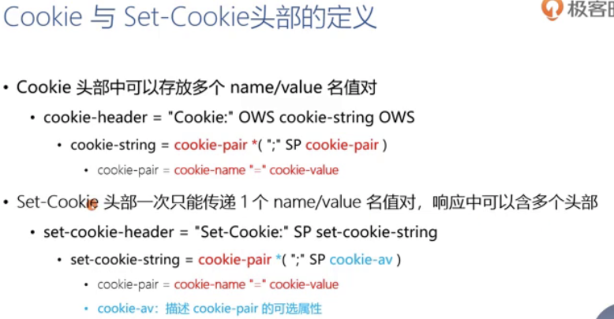

### Set-Cookie中描述cookie-pair的属性

### Cookie的使用限制

- RFC规范对浏览器使用cookie的要求
  - 每条cookie的长度(包括name，value以及描述的属性等总长度)至于要达到4kB
  - 每个域名下至少支持50个cookie
  - 至少要支持3000个cookie
- 代理服务器传递Cookie时会有限制
  - 因为cooki是放在http头部的，很多代理服务器可能会限制http头部的长度为4k或8k等，如nginx默认是32k，所以生成cookie的原服务器应当尽量减少每个cookie的大小

### Cookie在协议设计上的问题

- Cookie会被附加在每个http请求中，所以无形中增加了流量
- 由于在HTTP请求中的Cookie是明文传递的，所以安全性成问题(除非用https)
- cookie的大小不应超过4kb，故对于复杂的存储需求来说是不够用的

## 25. session及第三方Cookie的工作原理

### 无状态的rest架构 VS 状态管理

rest架构中有个属性叫stateless叫无状态，我们的cookie其实就是用来保存状态的，状态管理总共分为两方面(应用状态和资源状态)

### 第三方Cookie

第三方cooie经常是用来搜集用户的个人信息的。浏览器允许对于不安全域下的资源(如广告图片)响应中的Set-Cookie保存，并在后续访问该域时自动使用Cookie

- 如用户踪迹信息的搜集
- 如你在A网站浏览了些信息，后来你到另外一个B网站电子商务网站，它突然发现他也知道你曾经购买过什么样的商品，这往往是第三方cookie做的。

## 26. 浏览器的同源策略

浏览器必须要防止不同的站点间去读取对方的cookie信息，这就是浏览器的同源策略。

### 为什么需要同源策略

- 当url回车地址时，浏览器渲染引擎就会自动发出layout.css请求，发出image请求video请求Ads请求等，只有page.html是用户发出来的请求，其他请求不是用户自愿发出的请求，都是浏览器自动发出的，所以这就可能会导致一个问题，就是下图的问题，同一个浏览器网页上下文，视频发出的请求会请求到别的站点就会带走本站点所留下的cookie等信息

### 没有同源策略下的cookie

- 另外一个站点另一个域名都差不多，另一个站点如浏览器中打开另一个标签页

### 浏览器的同源策略

- 二级域名不一样也是不同源

- 可用性这种表单提交重定向都是允许跨域请求的，这会导致一个CSRF安全性问题
- 安全性3条都是针对于脚本，防止脚本去跨域操作，访问cookie更改别的站点的dom结构或ajax请求

### 跨站请求伪造攻击

- 由于浏览器的同源策略考虑其HTML创作者可用性，使得跨域写操作成为可能，特别是表单提交，所以就会导致一种攻击方式CSRF(跨站请求伪造)
- 具体流程：用户在浏览器中访问了一个银行站点站点A，浏览器中已经包含了相应的cookie，如果这个浏览器的用户去访问了一个危险的站点，这个危险站点提供了一个html页面，用户就去点击了html页面中的按钮(浏览器同源策略对表单提交是不限制的)，这个表单很可能在他的action中填入的url是A站点的url，所以能带上相应的cookie成功借助用户的手请求到站点A，做些危险转账的操作

- 怎么样去防止CSRF呢
  - 其中有个非常简单的办法，我们之前在请求的上下文中介绍过，浏览器会对一个请求加个referer头部字段，比如说在第4步的请求中带的头部referer字段，referer说该请求是来源于非法html页面站点的，所以站点A就可以做个处理(说这个请求来源的页面不是我本站的页面就进行阻止)，---但referer有个问题，如果浏览器本身实现不是很规范，他没有携带referer就不行了

#### CSRF的一种防攻击方式

我们前端想向服务器拉取一个form表单时，服务器在表单里面添加了一个带时效性唯一性的CSRFtoken属性隐藏起来用户是看不到的，而攻击者伪造的表单中是不带有本站点所具有的唯一的CSRFtoken所以它发起请求时服务器端就有效阻止了

## 27.通过CORS实现跨域访问

跨域访问也有其他解决方案，其他解决方案都是利用浏览器的一些bug还没考虑到的一些问题，RFC规范中推荐的就是CORS跨域方式能保证安全性的

- 除简单请求外的请求都是复杂请求，与简单请求的处理方式是不同的

### 简单请求的跨域访问

先来看看简单请求的跨域是怎么做的，若服务器返回的允许跨域域名中不是浏览器当前这个域名，则浏览器就不会渲染当前这个网络请求，服务器返回允许跨域域名并不多余，虽然请求时都自动Origin携带了当前来自哪个域名的头部，实际上服务器是不做任何限制的，只是回个消息，重点拦截策略主要在浏览器端做逻辑处理所以需要拿到服务器返回的Allow响应头部自己做判断决定是否渲染当前请求。

### 复杂请求的跨域访问

- 我们再来看看复杂请求的跨域访问是怎样的，复杂请求进行跨域访问的时候需要执行两步骤
  - 首先需要去问服务器，问服务器的这一步我们叫他预检请求，第二步才是实际请求
  - 预检请求包含下图中两个头部，整个预检请求的方法必须使用option方法。然后返回的预检请求的响应会有3个头部，下图中的maxAge是允许缓存的最长时间

- 再来详细看下跨域访问资源时请求时响应时用到的头部

> [多种跨域详解](https://www.cnblogs.com/fundebug/p/10329202.html)

## 28. 条件请求的作用

在断点续传这节课中介绍过当客户端已接受部分包体时，重新再获取后续包体时我们使用了If Match头部来询问服务器资源是否发生了变化，这就是一种条件请求，这节课我们将介绍条件请求的完整用法。

在介绍条件请求中我们需要先明白rest架构中所谓的资源表述的状态转移。首先每个URI对应的是一个资源，每个资源会有个表述，这个资源表述会随着内容协商而变化，也会随着时间而变化

### 条件请求

#### 验证

条件请求的预验证 先来介绍强验证器和弱验证器的概念

**验证器响应头部:**

- ETag中有个可选的weak标志就是两个字符x57为16进制的W，.2F就是斜杠/，ETag字段中带这个weak标志的就是告诉客户端当前是弱验证器，不带weak标志的就是强验证器

- 这个上次修改时间的字段常用于缓存响应的头部，上次修改的时间是不可能晚于Http-data的值的

#### 条件请求的头部

### 应用场景

#### 场景1. 缓存更新

- 首先客户端这里缓存是空的，第一次访问server，会返回相应的响应并返回ETag和last-modify两个头部，这时候客户端就会缓存这个响应并且存下last-modify和Etag字段值
- 我们客户端缓存了响应是有个过期时间的，如果当前时间已经超过了过期时间，已经缓存的响应就是已经过期了
- 过期的响应也是有用途的，比如再发起请求的时候加入IF-Modified-Since字段就是把我们之前缓存的过期了的lastmodify时间给填上，IF-None-Match就是把之前的ETag给填上，发给server
- server那边若说现在资源还没有发生变化，这时server不用返回资源响应了只需要返回304来告诉客户端说：你只需要复用我之前给你的资源就可以了，我这没有任何修改。这样就节约了传输body的流量
- 如果说server判断客户端携带的修改时间和Etag都已经变化了，我们server就返回新的资源响应

#### 场景2. 增量更新

在多线程下载那节，已经做过增量更新的演示了

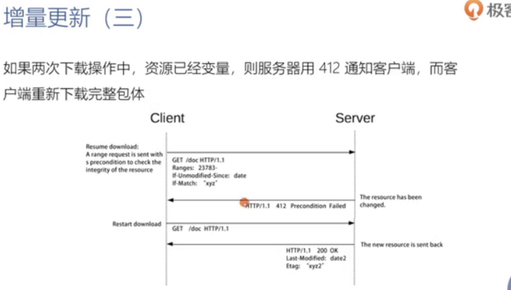

### 更新丢失问题

- 两次请求之间可能资源会发生变化买就会存在更新丢失的问题具体下图

- clent1与clinet2同时去修改资源的话，client1先修改完了提交了，这时clinet2后修改提交(此时clinet2还是基于最初的资源修改这时候提上去肯定与最新的资源冲突的)这时候就易导致client1的修改被错误的丢失
- 解决这个问题的方案就是**乐观锁**

- 即当client2再次提交时就让他失败，因为他没有基于client1提前提交的内容做第二次修改，所以他的修改应该是失败的，必须重新获取到client1的修改后的资源再做本地修改，然后提交才能成功，这个是我们要解决的问题，那怎么解决？-------就基于我们的条件请求，client2更新时会发起条件请求的字段 当条件通不过时client2自然就会做本地更新了

### 服务器处理条件请求常见规则

## 29. 缓存的工作原理

缓存是解决HTTP1.1协议传输中性能问题最主要的解决手段，缓存既有可能存在于客户端也可以存在于服务器中，当我们使用了过期的缓存的时候，有可能给用户展示的是错误的信息而导致一些bug，我们讲讲缓存的用法

### HTTP缓存原理

- HTTP缓存它其实是一个时间维度上的缓存

- 上图是第一次请求后 存到HTTP缓存下来，
- 服务器第一次响应后告诉浏览器缓存的手段是通过响应头的字段设置的缓存有效期：如`cache-control: max-age=31536000` 或 `expires: GMT格式时间`
- 下图是再次发起请求时会直接本地判断缓存有没有过期是在本地判断压根就没有发起网络请求，而之前那个range请求的缓存判断是由服务器判断的注意区分。

- 如果本地浏览器判断后缓存过期了，则拿着本地的ETag标签向服务器验证，这时候服务器告诉我说现在缓存这一份还有效的话就返回304告诉浏览器可以继续使用，若失效了则继续返回完整资源
- 向服务器验证的手段是给请求头加下字段，服务器就会识别去验证是否过期: `If-None-Match: 'Etag串' 和 last-modified：时间`
- 然后给出验证结果响应

### 私有缓存与共享缓存

- 私有缓存：一个用户的 在浏览器上的
- 共享缓存：都是放在服务器上的，供很多用户，通常放在代理服务器上，减少源服务器压力。正向代理反向代理都可用到共享缓存，像一些验证类的响应是不能被缓存的

#### 怎样判断是代理服务器缓存的还是源服务器给我们的

- 响应头中的有个age字段单位是秒，说该共享缓存有效期是age值秒，这个字段说明这个响应是共享缓存返回给我们的不是源服务器返回的

#### 过期的共享缓存--代理服务器

- 这个共享缓存也是有可能过期的，比如说代理服务器。
- 当第一次访问请求，代理服务器就从原服务器获得响应，就会先把这个响应放在代理服务器自己的缓存上面去
- 原服务器告诉它可以缓存100秒，代理服务器里就会有存100秒的定时器，如果10秒后客户端再次访问，则直接就命中了代理服务器中的共享缓存了
- 这时候代理服务器会给客户端一个age字段，赋值为10(意思就是已经在代理服务器共享缓存中存放了10秒种的)，作为给客户端的有效期字段。
- 此时100秒后第3个客户端发送请求后，代理服务器也过期了也会去发送向原服务器验证说“我这缓存过期了你处理下吧”并且会加If-None—Match字段
- 原服务器告诉代服304，此时代理服务器缓存直接返回第3个客户端作为响应
- **优点**：减少了带宽，没有传输文件资源的body内容 只是304状态码

#### 缓存实现示意图

我们的响应用了一个lRU双向链表，LRU就是最先不使用的就被淘汰掉了，因为我们总体的缓存的空间是有限的，比如我们只能存放30M，这个时候有源源不断的新的响应过来的话，那么最早不使用的那些响应就可以优先LRU链表来淘汰掉

## 30. 缓存新鲜度的4种计算方式

这节课我们介绍怎样判断我们的缓存是否过期，它与这个age头部是相关的

### 判断缓存是否过期

- lifetime是可以从下面4个值中取到，取任意一个，若同时出现则按照优先级

#### 为什么要预估缓存时间

- 由图可知，55%的请求没有携带max-age，没有去告诉客户端这个相应的资源要不要缓存，那么有一些内容是相对不怎么变化的，比如说图片jscss资源是相对不怎么变化的，但是由于服务器它的配置有问题，它没有考虑到带宽的优化和性能，所以它没有配置相应的描述缓存maxage的过期时间的内容，
- 那此时浏览器拿到服务器没有配置过期时间字段后说那我要不要缓存呢，浏览器决定还是缓存吧，那我缓存多长时间呢，这就浏览器通常基于RFC7234规范推荐的值来预估缓存时间

#### 常见的预估时间

- 由图可知，DownloadTime：浏览器获取到这个响应的时间。。lastmodified：服务器端显示的资源的上次修改时间

### Age头部及current_age的计算

### 代理服务器缓存中的Age头部 示例

- 可知Age的值主要在于客户端那层的当前时间和源服务器当时发出来的Date时间这两个值来决定的
- 打开一个百度首页响应回来的age值表示：源服务器发出的响应时间到浏览器接受到这个代理服务器返回的响应时间时间差就是age值69206秒
- 返回的lastmodify与age没有实际关联关系的

## 31. 复杂的Cache-Control头部

- 之前我们介绍缓存是否过期时，这里用到了cache-control头部，而cache-control的取值范围其实非常复杂，这节课介绍多种取值方法
- cache-control头部既可以用在请求中也可以用在响应中
- 取值有很多种，分为3类，第一类是红色部分，红色部分与上面红色部分是相同的，它后面要跟等号的，等号后面是十进制数字。第二类是黑色部分的，后面不用跟等号的就是单个值。第3类是蓝色的，蓝色的表示它有两种用法。如在请求中的no-cache只有一种用法，在响应中的no-cache有两种用法可以作为单个值可以后面接等号，private也是同样的道理

### 请求头部中

- 实际上是告诉代理服务器你应该使用怎样的缓存来给我，客户端会认的，不按照请求中头说的做客户端不认。

### 响应头部中

## 32. 什么样的响应才会被缓存

- 缓存分为两步，第一步是把响应缓存下来，第二步是将要发起个请求的时候，我们检查当前缓存是否可以使用已缓存的响应。
- 首先来看第一步 什么样的响应会被缓存

### 使用缓存作为的当前响应的条件

### Vary缓存

- 比如说客户端1访问时，源服务器用的是gzip编码，这时候我们代理服务器上缓存的是个gzip编码的内容。
- 如果客户端2来访问的时候明确的说“我只能接受用br算法来压缩的内容，这时候代理服务器上虽然客户端请求的路径都是一样的，但也绝对不能把已缓存的返回的”
- 因为第一次源服务器响应中有个vary头部，vary头部说必须根据content-Encoding判断是否缓存还是重新请求，源服务器给的是content-Encoding是gzip，而客户端2球的是br编码格式，此时必须重新向源服务器获取新资源
- 重新请求完后，代理服务器又存了个br编码的响应内容
- 此时客户端3说想要个br编码的响应，代理服务器就可以直接使用br的缓存来响应了
- 这就是响应头Vary字段的典型用法

### 如何缓存更新频率不同的

- 通常js和css资源文件可以缓存很长时间都不发生变化，但html文件经常会发生变化的，如果我们设置了一个不合适的过期时间以后呢，就有可能导致我们用户获取到了一个过期的资源，那么怎么解决这个办法呢，----- 我们通常分两步来解决
- 首先像html这样的文件或者就直接不让它缓存，如百度首页(响应头返回的Expires都小于Date字段了明显是不让浏览器缓存这一首页html)。。
- 或者给响应头Expires字段设置一个非常短的时间如10秒，为什么这么做呢？？？？？
  - 因为我们jscss文件准备用版本号的方式来缓存，我们通常在它的URI中加入版本号来识别，比如在百度首页中，当html发生更改的时候，css文件从v1改到v2，它的URI也变掉了，虽然客户端还在缓存v1版本的css文件但没关系，只要html及文件里面的css文件版本发生了变化
  - 客户端再次来访问html时(由于html更新频率比较快)，就能根据html文件获取到v2版本的css文件

### Warning头部：对响应码进行补充(缓存和包体转化)

- 当响应中没有明确的指定max-age时等等过期时间的时候，我们浏览器或者代理服务器为了节约带宽，它预估了一个时间的时候，我们一定会加个Warning: 113,就表示它是一个预估的过期时间。其他一些warning code都是对响应码做的一个补充

### 验证请求与响应

- 验证请求
  - 若缓存响应中含有Last-Modified头部,这时想告诉服务器已经有缓存了能不能直接使用的验证请求用下列字段
    - If-Unmodified-Since
    - If-Modified-Since
    - If-Range
  - 若缓存响应中含有ETag头部，多线程下载时断点续传时验证请求用到下列字段
    - If-None-Match
    - If-Match
    - If-Range

## 33. 多种重定向跳转方式的差异

- 重定向是http协议中重要的一个组成部分，重定向的请求与之前的请求的方法等因素都是相关的，而我们重定向本身这个请求也是可以被缓存的，下面我们看看这些协议的细节。

### 为什么需要URI重定向？

- 提交Form表单成功后，需要显示内容页，怎么办？
  - 如登录表单登陆成功后跳转到用户首页，就是一个重定向的作用
- 站点从HTTP迁移到HTTPS，怎么办？
- 站点部分URI发生了变化，但搜索引擎或流量入口站点只收录了老的URI，怎么办？
- 站点正在维护中，需要给用户展示不一样的内容，怎么办？
- 站点更换了新域名，怎么办？

### 重定向流程

- 首先我们要收到一个重定向的响应码，一旦有重定向响应吗 响应头部就会有个Location头部字段，该头部字段会定义个新的URI值，请求端后续的请求就会访问这个新的URI地址

### Location头部

- 值可以是个url也可以是个相对路径，相对路径的话需要后期由浏览器自动把host域名schema等前缀信息补全

### 重定向响应返回码

- 不同重定向响应码是从两个维度来划分的
  - 第一个维度就是可不可以缓存，永久重定向是可以缓存，临时重定向是不可以缓存
  - 第二个维度是重定向请求要不要使用原请求的两个组成部分(方法和包体)
- 通过这两个维度我们可以分成4类象限
  - 第一类叫: **永久重定向**, 301，308等
  - 第二类叫：**临时重定向**，302，303，307等（只是临时变更uri所以浏览器绝对不可以缓存，当访问百度http时候就会返回307重定向到https）
  - 第三类叫：**特殊重定向**：300，304
- 如301，303等强制使用get方法会把原请求的包体全部丢掉了，只是改成get方法重定向请求

### 重定向循环

- 重定向会产生一种循环，
- 服务端在生成Location重定向URI时，在同一条路径上使用了之前的URI，导致无限循环出现
- Chrome浏览器会提示：ERR_TOO_MANY_REDIRECTS

## 34. 如何通过tunnel隧道访问被限制的网络

- 当我们使用正向代理的时候，往往就会使用tunnel隧道，这节课介绍tunnel隧道都用来解决什么问题
- 隧道一定是通过connect链接建立起隧道的
- 当我们看到connect方法我们就知道后面传输的流量都将基于隧道进行传输

### Http Tunnel隧道

- 客户端想链接的服务器是orderes.joes.hardware.com,但是我们配置了一个正向代理服务器(为网关隧道端点)
- 我们首先发起链接，一定是先经过网关中，先和网关建立起TCP链接，然后网关(正向代理)会向源服务器建立起**b部分**的443端口tcp链接
- 网关与源服务器连接建立好以后，就会网关自己处理给予客户端建立起**d部分**http200connection的连接
- 这个时候 就把隧道建立成功了
- 接下来他们之间就可以客户端与源服务器之间通过网关来传输非HTTP消息了
  - http消息特点：必须是一个请求一个响应来回配套的，传输的格式也不需要像http格式一样不用必含header uri body
  - 可以传输任意格式，已经转变为了双向传输

- 之前介绍到的请求行的authority-form方法就是用于connect方法的

### Tunnel隧道的常见用途

- 如果防火墙不让我们传输443端口的时候，我们就可以通过80端口在防火墙中用隧道的方式来传递，看左侧b图解决
- 当我们在浏览器中配置了代理服务器，这个时候所有的请求是先到代理服务器的，如果我们的目标站点是一个打开了https的站点，但是我的代理服务器传输的是http80或8080端口，代理服务器也跟就没有这个服务器的ssl证书也没有浏览器端的证书，哪种证书都没有，那么怎样转发ssl流量呢，咋转发https呢
  - 也是用正向代理Tunnel隧道解决的看右侧b图可知
  - 客户端向正向代理配置的端口 ，这个端口发起connect请求，建立好隧道以后，接下来发送的所有的ssl流量，对于这个正向代理来说都是不可见的，它只是在双向传输TCP的报文消息而已

### HTTP隧道的认证

- 如果我们用到的正向代理，它是还需要认证的，需要用户名密码来认证的话，这个时候也需要在connect中传输相应的认证信息

## 35. 网络爬虫的工作原理与应对方式

### 网络爬虫定义

- 最常见的是搜索引擎如百度，百度会有自己的爬虫，它会爬取全网的一个站点，爬到目标站点以后加到自己的索引中，当我们访问百度去搜索相应信息的时候，就从这些分析器里面去读取，通过索引的方式来展示给用户

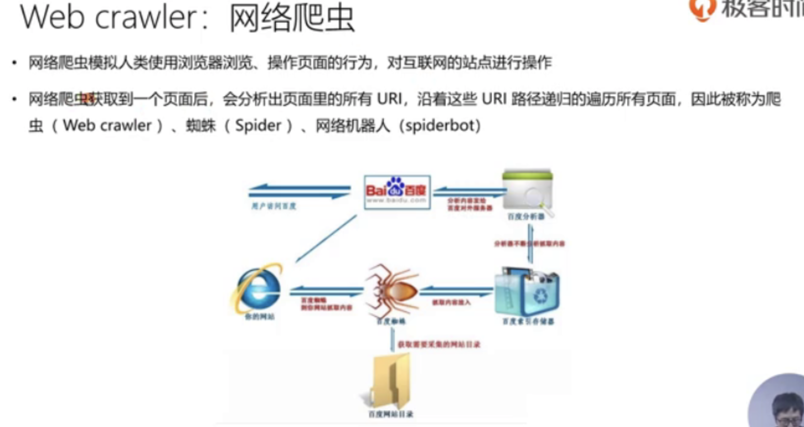

### 对待网络爬虫的2种态度：1，欢迎常光临

- SEO（Search Engine Optimization）搜索引擎优化
  - 合法的优化：sitemap，title，keywords，https等
    - 当有了站点地图sitemap后，搜索引擎就可以更有针对性的爬取相应页面，加入了title，关键字等以后也可以更精准的搜索结果，搜索引擎还希望我们全站http是加密的
  - 非法的优化：利用PageRank算法漏洞
    - 一些商家利用算法漏洞很多僵尸页面都指向商家网页，这样PageRank算法是找出相关页面中被引用量最多的页面，这样就是商家页面在搜索排名中靠前

### 对待网络爬虫的2种态度：2，拒绝访问

- 比如我们买机票的时候抢特价机票，淘宝购物各大网站比价，这种的网络爬虫都是非常不欢迎的，为了对抗爬虫诞生的图片验证码，
- 当验证码可以通过OCR方式光学识别，自己用人工智能算法识别出来的话，我们就需要做更复杂的对抗策略
- 稍复杂一点的如12306中的图形验证码中带需要计算结果的验证码，如3+2=5，还有下列图案中挑选目标图案，
- 再后面就是动作性的 拖动滑块验证和直接短信验证 防爬取能力强

### 网络爬虫如何抓取数据

- 要抓取的数据就是我们的html页面，现在html页面都是由js执行更新的ajax请求的，所以爬虫首先必须要模拟浏览器渲染引擎
- 这里面爬取速度就要涉及到深度优先还是广度优先去
  - 深度优先：有个好处，就是可以复用长连接，我们http请求的时候，被同一个站点请求的时候可以完全复用一个连接，可以解决tcp的uci控制，也可以直接减少3次握手的4次挥手关闭连接的网络消耗
  - 广度优先；更适用于优先爬取更重要的页面

### 爬虫常见的请求头部

- User-Agent: 描述浏览器信息 也可以用作 识别是哪类爬虫
- From: 提供爬虫机器人管理者的邮箱地址
- Accept: 告知服务器 爬虫对哪些资源类型感兴趣
- Referer: 相当于包含了当前请求的页面URI

#### 识别出是不是爬虫

从抓包的User-Agent信息和From信息就能看出这个http链接是网络爬虫，如下图的Googlebot就是谷歌的网络爬虫请求

### 如何告知爬虫哪些内容不应爬取

- 我们可以通过robots.txt文件来告知，一般爬虫访问我们网站会先访问robots.txt站点来了解爬虫相应权限，然后再访问到服务器
- 如搜狐的robots站点：https://www.sohu.com/robots.txt

## 36. HTTP基本认证

一般登陆都是由服务器给登陆ui界面然后输入后交个服务器，得知结果，但浏览器都提供了一种http的基本认证，带浏览器默认的登陆输入框

- 与以往不同的是，由上图知，服务器第一次返回的是401且响应头是WWW-Authenticate头部字段，这叫告诉浏览器使用基本认证模式 需要用户名密码登陆我这个网站
- 当浏览器拿到这个响应后，浏览器就会拿到这样让你登陆的对话框，几乎所有浏览器都自带这个默认对话框模块，我们就在对话狂中输入用户名密码
- 然后这个用户名密码会发起客户端请求加个Authorization认证请求头部，以base64的方式传给服务器，服务器校验通过以后就会返回200
- base64是明文传输因为它可以反推，一般都是用TLS/SSL来传输

### 认证请求

- auth-scheme的basic就是基本认证的意思

### 认证响应

## 37. WireShark的基本用法

- @TODO 待看
Wireshark是最强大的抓包工具了

## 38. 如何通过DNS协议解析域名？

- 在浏览器发起报文之前，会先根据url中的域名，通过DNS协议获取到IP地址，基于这个IP地址，我们才能建立起TCP连接，才能在TCP链接上传输HTTP的request和response。这节课介绍DNS的报文格式是怎样的

### 什么是DNS呢

- DNS: 一个用于将人类可读的“域名”与服务器的IP地址进行映射的数据库
- 映射的是用的递归查询，
- 我们经常所遇到的DNS劫持（通过给我们传递了个假的DNS server，这时候我们给了个域名，假的DNSserver就给我们返回了一个错误的IP地址，这时错的IP地址进入错误的服务器地址就可以对我们攻击了，可以进驻木马文件，电脑上的信息就会丢失）
  - 运营商的DNS server可能也会夹杂着把一些代理服务器的一些地址广告脚本啥的来通过DNS解析的步骤中潜入传递给我们，造成运营商也会经常给我们弹些广告
- 递归查询
  - 如www.baidu.com,会先从根域名服务器来查询即先从com查，查完之后再接着查baidu二级域名往后。。
  - 根域名服务器（也叫权威服务器）

### DNS域名结构

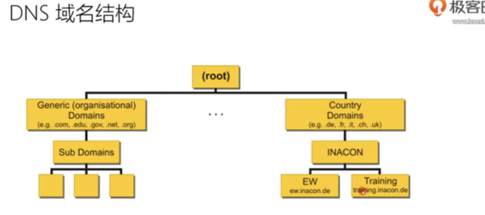

### 完整DNS解析-递归查询-整流程

- 访问DNS服务器，来解析域名，先到DNS Resolver服务器里，这个服务器又需经过3次访问服务器，先去根服务器找，根服务器告诉我们一级域名.comn你去哪里找
- 然后第4步，去找com类的解析服务器，然后返回你example.com应该去找亚马逊53域名服务器，
- 然后在第5步里，终于找到了总域名对应的ip地址
- 然后返回第7步，访问站点服务器拿到页面

### DNS报文: 查询和响应

- query: 查询页面
- response: 返回IP地址

- Questions格式3部分组成，QNAME(就是一段要查的域名) + QTYPE + QCLASS
- TTL是ip地址的生存时间

- 16进制编码来在http协议中传输的，如image的i字母对应的asiic码再变成16进制编码在报文中传输，如16进制编码中a代表10
- 上图中可以看出，一块一块2位的16进制码流：是一个字节

### dig工具查询

- 终端需要装dig工具来查询DNS报文
- `dig image.baidu.com`

## 39. WireShark的捕获过滤器

- @TODO 待看
- websoket协议是http协议的一个升级，在学习websoket协议之前，先学习下wireshark的过滤器语法

## 40. wireShark的显示过滤器

- @TODO 待看

## 41. websocket解决了什么问题

> [websocket演示网址](www.websocket.org/echo.html)

### 如何及时获得更新？从轮询到通知

- http1.1中想及时获得通知 得手动在客户端加个定时器，不断的发ajax请求，问后端是否有更新，这是**ajax轮询**，很耗费网络性能
- 当有了websocket协议后，websocket是可以反向通知的
  - websocket首先向服务器发起协议请求说，向服务器说订阅一类消息，服务器只要发现这类消息有更新，就会不停的通知客户端

### Chrome请求列表: 分析Websocket

- 箭头朝上是发到服务器端的，箭头朝下是接受自服务器端的

### 支持双向通讯的WebSocket

最大的优点是实现了服务端的推送

- rfc6455(2011.12)规范中定义的
- 双向通讯的优劣
  - 优点是支持了及时的推送消息
  - 缺点是可伸缩性比较差，实际上建立起一个链接以后，如果对服务器端进行扩容，增加链接数的时候，实现方案是比较复杂的，也是能做到的
- 如何管理会话
  - 因为我们的会话是从http升级过来的，我们需要保证关闭会话的时候是有效的双向关闭的，如何管理我们的会话
- 如何维持长连接
  - http1.1中已有长连接，但那个是非常简单的，通常会设一个65秒的定时器超时了就给它关掉
  - websocket它的长连接更长，用乒乓这种心跳方式进行链接
- 兼容HTTP协议
  - 我们先要考虑到正向代理反向代理，首先是服务于http1.1协议的，就需要从http1.1协议升级到Websocket协议
  - 这个兼容也表现为端口的复用比如说WS默认端口是80，WSSS是443端口
  - 端口复用（如WS默认端口是80，WSSSS是443端口）
- 支持扩展
  - 如permessage-deflate扩展
    - http1.1为了做压缩设置contentEncoding头部，Websocket如果要做压缩可以通过deflate扩展压缩

## 42. Websocket的约束

### WebSocket的成本

- 牺牲了简单性的情况下也能费力的达到可伸缩性
- 默认下长连接也是无状态的，我们可以做到有状态的，请求2基于请求1

### 长连接的心跳保持

- HTTP的长连接只能基于简单的超时(常见为65秒)
- WebSocket的长连接可以基于ping/pong心跳机制维持

### 兼容HTTP协议

- 默认使用80端口或者443端口
- 协议升级
- 代理服务器可以简单支持
- 过程：过程中需要先经历过一次握手来协议升级，通过握手来将http升级到websocket协议，握手成功后升级完以后就是双向传输了，中间很多代理服务器都可以很简单的进行双向传输，其实就是把tcp协议暴漏给应用层

### 设计哲学：在Web约束下暴漏TCP给上层

- Web约束有很多，不光是http协议还有很多代理服务器就是我们rest架构下，或者说把http协议基于tcp层的
- 我们需要把http基于tcp层双向通讯的特点，把tcp协议直接暴漏给上层(不做各种应用层的封装)，
- 如HTTP2协议里面就大量封装了应用层消息，而Websocket中就是简单地把tcp暴漏上去了

- 元数据去哪了？

  - 对比：HTTP协议头部会存放元数据-如-http1.1中有很多header头部，会存放很多元数据，
  - 由WebSocket上传输的应用层存放元数据(因为websocket中并没有定义存放元数据的地方)
- 基于帧：不是基于流(HTTP,TCP)
  - 比如我们TCP是基于流的，只要保证每个字符是有序的自然能保证接受方有序
  - websocket是基于frame帧的
  - 每一帧要么承载字符数据Asic，要么承载二进制数据binary
- 基于浏览器的同源策略模型(非浏览器无效)
  - 它也有跨域问题
  - 可以使用Access-Control-Allow-Origin等头部
- 基于URI，子协议支持同主机同端口的上的多个服务

## 43. websocket协议格式

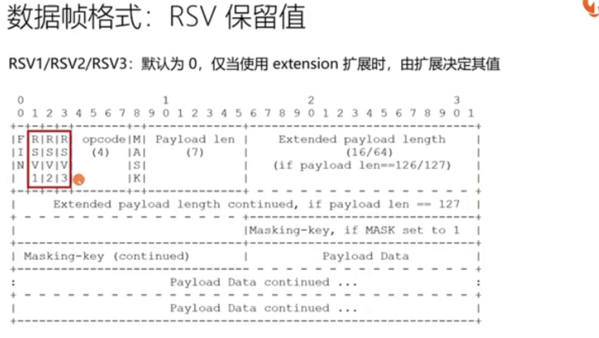

## 44. 如何从http升级到websocket

今天介绍websocket会话建立的第一步，即完成websocket握手。握手这步其实是从http1.1协议中升级来的
我们先来看看当我们建立链接时，客户端应该提供些什么样的消息呈现在websocketURI中

- 请求必须是get方法必须基于1.1才行

- 如何证明握手被服务器接受呢

## 45. 传递消息时的编码格式

上节课是如何建立起websocket会话，建立好以后就可以传递消息了。
首先要看消息与数据帧的区别

### 消息与数据帧

- Message消息
  - 一条消息由1个或者多个帧组成，这些数据帧属于同一类型
  - 代理服务器可能合并，拆分消息的数据帧
  - 如httprequest和response就是一条消息，消息是应用端发送的消息的一个信息，一条消息就可能非常大，而每个数据帧所承载的数据是有限的所以一个消息就拆分成多个帧组成
- Frame数据帧
  - 数据帧
  - 文本帧，二进制帧

- FIN表示一个消息的结尾，FIN为1表示这条消息结束了

### 发送消息

- 确保websocket会话处于open状态
- 以帧来承载消息，一条消息可以拆分多个数据帧
- 客户端发送的帧必须基于掩码编码
  - 客户端向服务端发送消息的时候必须要经过掩码处理
- 一旦发送或者接受到关闭帧，链接处于closing状态
- 一旦发送了关闭帧，且接收到关闭帧，链接处于CLOSED状态
- TCP链接关闭后，websocket链接才完全被关闭

## 46. 掩码及其所针对的代理污染攻击

### 为什么要做掩码处理

有种攻击方式叫针对代理服务器的缓存污染攻击，为了减少这种污染攻击风险的，下面就是污染攻击的示意图

- 不当代理服务器就是不认识websocket协议只能透传http协议的
- 这种攻击主要是浏览器方和代理服务器有问题
- mask就是掩码的标志

- mask为1时就代表客户端发送来的消息了，服务端消息mask就为0

### 掩码如何防止缓存污染攻击

- 目的：防止恶意页面上的代码，可以经由浏览器构造出合法的GET请求，使得代理服务器可以识别出请求并缓存响应
- 强制浏览器执行以下方法
  - 生成随机的32位frame-masking-key，不能让js代码猜出(否则可以反向构造)
  - 对传输的包体按照frame-masking-key执行可对称解密XOR异或操作，使代理服务器不识别
  - 消息编码算法：
    - j=i MOD 4
    - transformed-octet-i = original-octet-i XOR masking-key-octet-j

## 47. 如何维持会话心跳

- tcp链接中其实就是一个简单定时器，定时器达到以后还没有请求过来的话，就直接把链接关闭了。。websocket要维护自己的长连接会话将会更复杂。
- 定时器到达以后，可以发一个pingpong这样的心跳，如果心跳仍然存在，我们就仍然保持链接，如果心跳不存在了就关闭链接，下面介绍一下心跳帧的格式

- 收到一个ping帧就该回一个pong帧，pingpong一定是一一对应的，属于控制帧

## 48. 如何关闭websocket会话

websocket协议是双向传输的协议，所以在关闭会话的时候也需要进行双向关闭的，且websocket协议承载在tcp协议之上，通常我们应该在tcp协议关闭之前首先关闭websocket协议

### 关闭会话的方式

- 控制帧中的关闭帧：在tcp链接之上的双向关闭
  - 发送关闭帧后，不能再发送任何数据，但还能接受数据
  - 接收到关闭帧后，不再接受任何到达的数据
- TCP链接意外中断
  - (tcp断了websocket会话自然也就中断了)

----

## 49. HTTP2 => HTTP1.1发展中遇到的问题

http2对1.1版本主要做了性能上的改进，1.1在性能上遇到了很多问题

### http1.1带来的变化

- 从几kb大小的消息，到几MB大小的消息
- 每个页面小于10个资源，到每页面100多个资源
- 从文本为主的内容，到富媒体(如图片声音视频)为主的内容
- 对页面内容实时性很高的要求的应用越来越多

### http1.1高延迟的问题

- 高延迟带来页面加载速度的降低
  - 随着家里的带宽的增加，延迟并没有显著下降（因为延迟除了距离以外，还有最后一公里各种路由器交换机排队的消耗情况，所以到一定程度后延迟就很难下降）
    - 高延迟会对我们的页面带来很大的影响
  - 并发连接有限（我们的chrome一个页面最多同时只能打开6个连接）
  - 同一链接同时只能在完成一个http事务(请求/响应)才能处理下一个事务

- 高链接VS高带宽
  - 单链接上的串行请求
  - 无状态导致的高传输量(低网络效率)

### 无状态特性带来的巨大的HTTP头部

- 重复传输的体积巨大的http头部

http1.1还有个问题，它是无状态的，每个请求都要携带完整的头部 产生网络效率的下降

### http1.1为了解决性能所作出的努力

### http1.1不支持服务器推送消息

不能实时的感知到服务器资源的变化，想知道还必须得轮训去得知服务端情况。不能做到服务端资源变化了主动给客户端发消息

## 50. http2特性概述

### 主流浏览器对http2很好的支持

### http/2的应用状况

- 截止2019年5月17号，互联网上使用http/2协议的站点已经达到37.2%
- 快速推广的原因
  - 未改变HTTP/1.1的基本语义
  - 基于TCP，仅在应用层变动

### http/2最大特点：多路复用的提升

> [具体文章介绍多路复用](https://segmentfault.com/a/1190000011172823)

### HTTp/2的强大之处

> [测试对比1.1](https://http2.akamai.com/demo)

### HTTP/2主要特性

- 传输数据量的大幅减少（下面两个原因）
  - 以二进制方式传输
    - 原先以asCII的方式大量httpheader头部的方式改为以二进制的方式传输
  - 标头压缩
    - 采用HPEG标头压缩技术
- 多路复用及相关功能
  - (高带宽高延迟的网络采用这种多路复用，能大大提升性能)
  - 消息优先级
- 服务器消息推送
  - 并行推送

## 51. 如何使用wireshark解密TLSSSl报文

HTTp2协议既可以运行在TLSSSL之上，也可以直接运行在TCP之上的，但是所有的浏览器中都强制要求必须基于TLSSSL协议才能够使用HTTP2协议

- 当我们使用tsl加密的时候，每次对称加密的密钥都是不同的，都是随着链接生成实时变化的。怎样才能解密TLS将协议报文还原为http2的帧格式呢
- 这节课介绍用wireshak抓取并解密http2报文的方法

### Chrome浏览器检测网站是否使用HTTP/2的插件

> [插件](https://chrome.google.com/webstore/detail/http2-and-spdy-indicator/mpbpobffinpcgagjijhmgnchggcjblin)

### HTTP/2应用层协议之下的TLS层

- 我们所有的http的报文信息是要被TLS1.2加密的
- [相关文章介绍](https://www.sohu.com/a/158349629_468741)

#### TLS1.2的加密算法

#### wireshark如何解密TLS消息如何得到每次不同的密钥呢

- 原理：获得TLS握手阶段生成的密钥
  - 通过Chrome浏览器DEBUG日志中的握手信息生成密钥
- 步骤
  - 配置Chrome输出DEBUG日志
    - 只需要在电脑系统设置中配置环境变量SSLKEYLOGFILE即可，之后就会在e盘中webprotocol文件夹中自动写入日志文件，可以看到所有的握手信息
  - 在wireshark中配置解析DEBUG日志
    - 编辑-首选项-Protocols-TLS/SSL
      - (Pre)-Master-Secret log filename

### 二进制格式与可见性

- HTTP2的二进制格式降低了可见性相比1.1版本的ASICC码流
- TLS/SSL降低了可见性门槛
  - 代理服务器没有私钥不能看到内容，经TLS加密后就已经没有什么可见性可言了

## 52. 在tcp上从HTTP1升级到HTTP2

- 基于TCP的HTTP2协议是怎样建立起会话的

### HTTP2是不是必须基于TLS/SSL协议

- IETF标准不要求必须基于TLS/SSL协议
- 浏览器要求必须基于TLS/SSL协议
  - 两个原因 1是希望网络更安全希望全栈加密
  - 2是握手，http2要经过握手，不经过TLS的HTTp2也要经过握手环节
- 在TLS层ALPN扩展做协商，只认HTTP/1.x的代理服务器不会干扰HTTP/2
- schema：http://和https://默认基于80和443端口
- h2：基于TLS协议运行的HTTP/2被称为h2
- h2c：直接在tcp协议之上运行的HTTP/2被称为h2c

### 介绍h2c与h2区别

- 消息字段上的区别

### h2c升级演示

- 不使用TLS协议进行协议升级
- 客户端测试工具：curl（7.46.0版本以上才支持http2协议）
- [测试网站](www.nghttp2.org)
  - 这个站点既支持基于TCP协议又支持基于TLS协议的
  - 终端命令`curl http://nghttp2.org --http2 -v`

### H2C: 客户端发送的Magic帧

- Preface（ASCII编码，12字节）
  - 何时发送？
    - 接受到服务器发送来的101 Switching Protocols
    - TLS握手成功后
  - Preface内容
    - 一串加密串解密后是下列PRI内容
    - PRI * HTTP/2.0\r\n\r\nSM\r\n\r\n
  - 发送完毕后，应紧跟SETTING帧
  - 设置帧发送完毕以后，HTTP/2会话才算正式建立

## 53. 在TLS上从HTTP1升级到HTTP2---建立http/2会话

略～ 需要细了解

## 54. 帧、消息、流的关系

- 一个站点只能建立一个tcp连接，http2的多路复用就是基于connection多个流的实现

- 每一个消息就是二进制帧，每个消息有两种帧HEADERS帧与DATA帧，这俩对应的就是HTTP1.1中的消息内容Message

- 同一个frame下传输同一个stream下的数据必须是有序的 得按序传不能先传stream3DATA再传stream3HEADERS，跨越stream是完全无序的，我们的多路复用是必须跨stream才能实现多路复用的
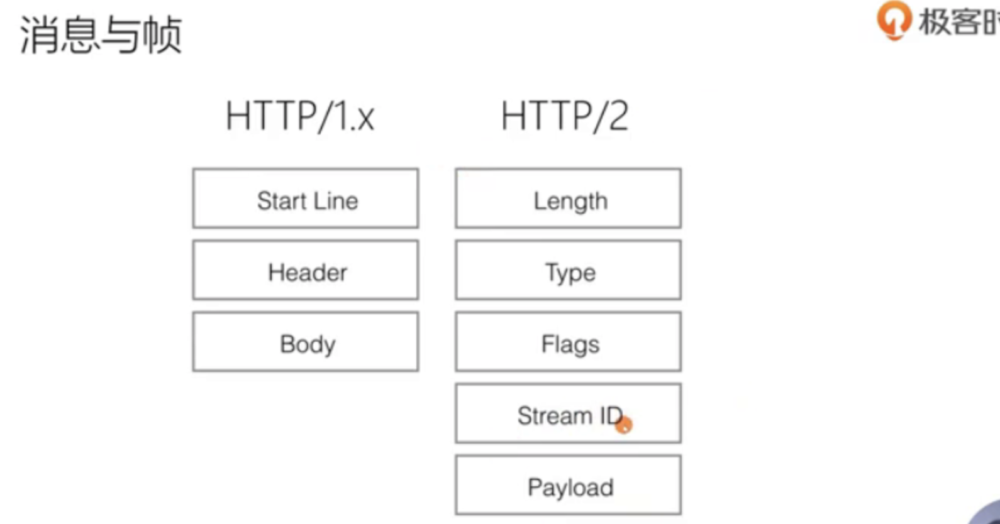
- 1.0中是request消息response消息是一个message单位的，在2.0中一个帧单位作为一个消息。
- 一个stream中可以存放多条消息，一个消息由1个或多个帧组成的，帧中的streamID与对应流关联起来的

## 55. 帧格式: Stream流ID的作用

## 56. 帧格式: 帧类型及设置帧的子类型

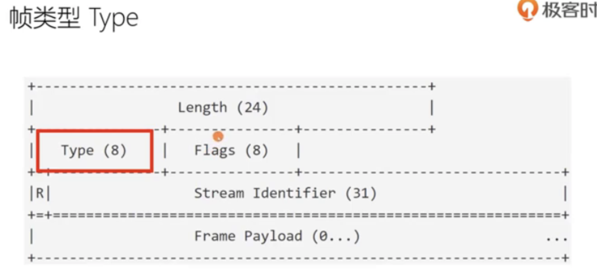

## 57. HPACK如何减少HTTP头部的大小

http协议是个无状态的协议，所以导致每次请求都会传输重复的大量http头部，使得http1.1协议效率非常低下，我们http2是解决了这个问题的。
它的解决方法就是用的HPACK算法。这个算法由后面4节课讲解

### HPACK头部压缩

- RFC7541
- 三种压缩方式
  - 静态字典
  - 动态字典
  - 压缩算法：Huffman编码（最高压缩比8.5）

### 1. 静态字典

- https://http2.github.io/http2-spec/compression.html#static.table.definition
- 含有value的表项
- 不含value的表项
- 就是按照表里的index值直接在http/2中传入index值就可以代表相应的头部和值了

#### HPACK压缩示意

把静态表和动态表编码完以后变成encodedHeaders放到流帧里传输

#### HPACK压缩比 （借助工具h2load）

为什么我们可以反复地多次传输 因为依靠我们的动态表可以提高大量压缩

## 58. HPACK中如何使用Huffman树编码

HTTP/2 header是如何编码的首先得清楚Huffman编码是如何做的，Huffman编码是被各种压缩算法所采用的原理
HTTp/2中header怎样还原到Huffman编码前的明文

### Huffman编码

- 原理: 出现概率较大的符号采用较短的编码，概率较小的符号采用较长的编码
- 静态Huffman编码
  - https://httpwg.org/specs/rfc7541.html#huffman.code
- 动态Huffman编码

### Huffman树的构造过程

Huffman编码，首先要进行Huffman树构造过程

- 计算各字母的出现概率
- 将出现频率最小的两个字母相加构成子树，左小右大
- 重复步骤2，直至完成树的构造
- 给树的左链接编码为0，右链接编码为1
- 每个字母的编码即从根节点至所在叶节点中所有链接的编码

## 59. HPACK中整型数字的编码

## 60. HPACK头部中头部名称与值的编码格式

上节课讲Huffman和整型数字的编码格式，那么他们编码完后是怎样使用的呢？
这节课讲frame中对Header进行编码时究竟是怎样进行编码的？

### HEADER帧的格式

每一种frame帧都是不一样的 ，先看HEADER类型帧的编码格式

- 下图其中Header Block Fragment就是存放的Header头部，weight是权重优先级相关的
- 当header帧特别大的时候，后面还会跟一个CONTINUATION持续帧，来补充header头部（PUSH_PROMISE帧也是推送的header头）

### HeaderBlock具体怎样编码

- 为了说清楚HeaderBlock编码再讲下静态表与动态表

前3位001就是要修改动态表的大小

## 61. 服务器端的主动消息推送

### 服务器推送的价值

- 提前将资源推送至浏览器缓存
- 特性
  - 推送可以基于已经发送的请求，例如客户端请求html，主动推送js文件
  - 所以说他的实现方式和websocket是完全不一样的即每推送一个资源必须对应一个请求
- 实现方式
  - 推送资源必须对应一个请求
  - 请求由服务器端PUSH_PROMISE帧发送
  - 响应在偶数ID的STREAM中发送

### 浏览器获取html资源过程

- 先看http1.1中获取资源的过程

- 再看http/2中获取资源的过程
  - 在http2的推送过程中可以使用PUSH_PROMISE帧实现并发
  - 服务器在推送html内容时同时在流中直接并发了相关的css资源的PROMISE通知帧(说等会接下来的流会给你具体css资源发过来)一并随html文件发给客户端
  - 同时又发送第二个流stream2给客户端，流之间并发可以无序，流中的帧需有序发，最终前后端只发生一次前后端请求，都是有
  - 服务器并发一次性推送的多个流

- 更复杂一些：当前html需要多个资源 就会接连发送多个流给前端可无序

### PUSH推送模式的禁用

- SETTINGS_ENABLE_PUSH (0x2)
  - 1表示启用推送功能
  - 0表示禁用推送功能

## 62. Stream的状态变迁

服务器为每一个stream流都会维护着一个状态，这个状态是怎样变迁的呢？

### stream特性

- 一条TCP链接上，可以并发存在多个处于OPEN状态的Stream
- 客户端或者服务器都可以创建新的Stream
- 客户端或服务器都可以首先关闭Stream
- 同一条Stream内的Frame帧是有序的
- 从StreamID的值可以轻易分辨PUSH消息
  - 所有为发送HEADER/DATA消息而创建的流，从1，3，5等递增奇数开始
  - 所有为发送PUSH消息而创建的流，从2，4，6等递增偶数开始

### Message特性

- 一条HTTP-Message由一个Header(可能含有0个或者多个持续帧构成)及0个或者多个DATA帧构成
- HEADER消息同时包含HTTP/1.1中的start line与headers部分
- 取消HTTP/1.1中的不定长Chunk消息

### Stream流的状态

- 所有流都起始于idle状态，结束于closed状态
- 起始于idle状态，无论是收到还是发送帧都会进入到open状态，在open状态下我们发送任何帧都是可以的。
  - 如果我们要收到reset帧我们就要立刻进入到closed状态结束流，其他帧都进入到half closed半关闭状态。
  - 半关闭状态分两种，一种是接收ES的另一种是发送ES的
  - 剩下的路线状态自己看图

## 63. RST_STREAM帧及常见错误码

stream流无论处于open状态reser状态halfclosed状态都可以通过或发送或接受到一个reset即RST帧来进入closed状态，这节课就介绍reset帧即RST_STREAM帧是怎样的

- http1.1中一个链接对应一个请求，发出去的请求中想终止的话，直接关掉连接就可以了，
- 但http2中想关闭流不是那样做，因为多个流共享同一个连接，要关连接的话就会影响到其他的流，这时就要用到reset帧了
  - reset帧也叫RST_STREAM帧，他是用来立刻终止一个未完成的流
  - 其他帧都得有1字节8位的flag，而这个不用flag只需要4个字节32位的错误码表示

### 常见的错误码

## 64. Stream优先级与资源分配规则

- 当我们页面访问时会发起很多个请求，有请求图片有css有js的，这些体验相对与用户的优先级来说肯定是不一样的,css高优先，js资源次之，png图片等更次之
- 每一个请求可以运行在独立的stream上，一个stream上也可以跑很多请求，priority设置帧是针对于每一个stream来设置的一个优先级
- 之前在HEADER帧的格式中就有设置权重的一个8位占位的位置

### 数据流优先级

### exclusive标志位

- 他这个E是一种独占的标志位

## 65. 不同于TCP的流量控制

http/2在应用层也提供了流量控制，既可以针对整个链接，也可以针对每一个stream流

- 拥塞控制是为了防止整个网络中许多个连接互相影响可能会造成恶性影响，他有个拥塞控制时间，这段时间内是没办法达到优化的窗口发送量
- 要是在长连接中，只有第一次链接才会有拥塞控制，后面的事务是不受拥塞控制的

### 流量控制的帧叫WINDOW_UPDATE帧

- 由接收端告诉发送端说我现在能接收多少字节即窗口范围。
- 帧格式是31位窗口大小
- 流控仅仅是针对于直接连接的两端，也有可能是代理服务器，所以代理服务器就不需要向上透传WINDOW_UPDATE帧到源服务器

### 流控制窗口

### 控制并发流的数量

- 设置帧中还有个并发流的控制

## 66. http2与gRPC框架

- 服务器之间通信时也可以使用HTTP2通信，比如gRPC框架就是运行在http2之上
- 这节课演示下使用rpc发送消息时，消息具体在http2上是怎样编码的

略～需要时再看

## 67. HTTP2的问题及HTTP3的意义

1. 首先tcp的是3次握手，还有基于tls的握手，由于握手时间过长 会影响性能
2. 还有个队头阻塞问题
   1. 什么是阻塞，如图中有3个颜色红绿蓝stream流，不同的stream他们是可以并发的，并发以后是作为一个tcp报文发出来的，经过我们操作系统发出的时候，流就变成了一个一个的ip保文串线拍成一队地发到网络中去，作为ip报文转发的时候是混在一起无序的，但到达的时候还是和以前一样拍成一队有序的----这是TCP协议约束决定的。
   当http2接受端收到报文的时候，就会按照sreamID把队列型流分开，分成明确的3个流，交给我们应用程序处理
   2. 如果网络中出现问题？
      1. 如果如图中红色的报文丢失了，丢失了以后，我们的接收端虽然收到了剩下的流们，但我们的操作系统不会给剩下的报文给到我们的接收端的应用层，而是一定要等到红色的报文重发过来(它TCP内部有个定时器等不到会定时重发的)
      2. 万一重发的话，本来是并发的 就又变成串行了，就造成了队头阻塞的问题
   3. 队头阻塞问题是TCP的必须保证资源有序到达而决定的
3. TCP是由操作系统内核实现的，操作系统内核更新的成本是非常高的，导致更新速度是非常缓慢的

### QUIC协议

- QUIC协议是HTTP3里的了，http3的上层还是用的http2的API，QUIC协议是依据的是UDP协议，对应HTTp2的TCP功能部分TLSs部分放在QUIC协议里实现了

### 使Chrome支持QUIC

- 有GQUIC和IETF QUIC
- IETF QUIC协议只是个草案

> [chrome://flags/#enable-quic](chrome://flags/#enable-quic)

## 68. HTTP3/QUIC协议格式

- http3在udp上的QUIC协议中解决了拥塞控制的方案也保留了stream的特性能实现多路复用，是http2上的改进

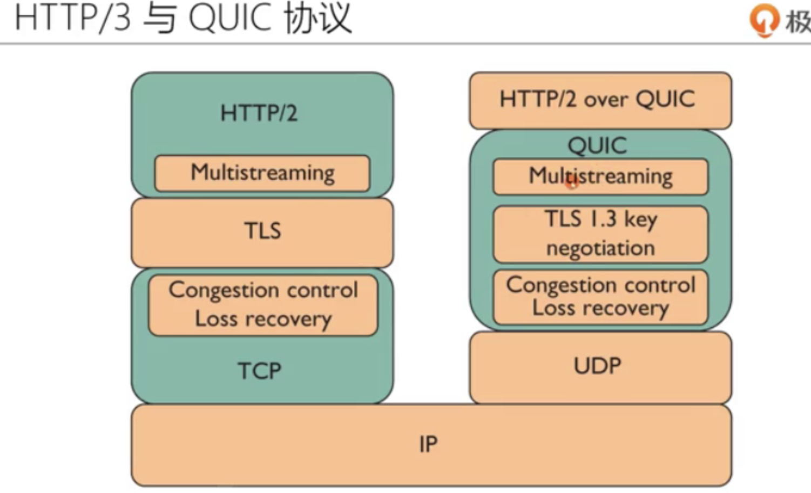

### HTTP3的链接迁移

### 解决了队头阻塞问题

- UDP报文先天没有队列概念即使红色报文丢了也没关系，接收端不需要保证他们有序到达，在QUIC协议中能本地转化出组装成对应流报文发出

### 解决了握手次数问题

- 之前tcp都是需要3rtt握手，这个http3只需要1rtt握手
- 首先传输层和表示层做一次合并就能减少一次握手了

### 新特性0RTT握手

## 69. 七层负载均衡都做了些什么

- OSI网络模型，工作在2层数据链路层的设备称他为交换机，工作在3层中的网络层的设备叫路由器，
- 工作在4层传输层上开始有一些负载均衡，

### 4层上的负载均衡特点

- 可以把客户端传过来的tcp报文，以第二条tcp报文链接的方式转发到服务器，对于udp报文也可以
- 4层上的负载均衡不会解析tcpudp上承载的应用层协议，而7层负载均衡不一样了

### 7层负载均衡特点

- 如图中7层上负载均衡可以把http1.1的会话转化成1.0的会话给到服务器，这不就解析了应用层协议并做转发

### http协议转换

### WAF防火墙

防火墙是可以天然放在7层负载均衡中的

### 负载均衡

- 7层负载均衡还有个功能是负载均衡功能，就是我们后面有很多个服务器 及时选择负载最低的服务器

### 负载均衡-缓存功能

- 7层负载均衡经常要具备的缓存功能，因为我们解析出来了所有的包体body信息啥的，我们就可以在7层负载均衡中间做个缓存，这个缓存就是，共享资源就是可以解决热点资源的访问

### 总结
- 学习http2协议要从4个特性入手：
  1. 支持了多路复用(多路复用一定是基于stream流这个概念)
    1. 流控
    2. 不同流之间要有优先级
  2. 协议升级
  3. HPACK算法(可以把http1.1中最头疼的无状态导致的每次请求都带大量header头部)
  4. http2通过push_promise帧，支持了一种服务器推送的方法

## 70. TLS协议的工作原理

这节课核心目的就是在http3中将要使用的tls1.3协议

### TLS设计目的

- 身份验证
- 保密性
- 完整性

@TODO后面待看
